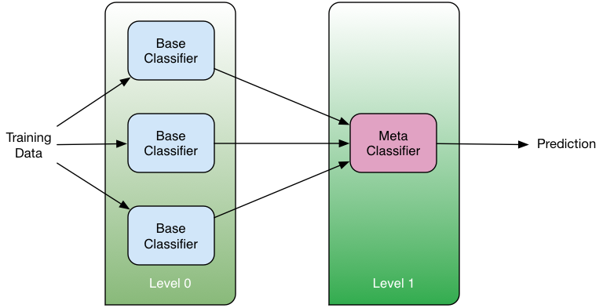

# Stacked network-based classifiers

"Stacked generalization" was introduced by Wolpert in 1992 as a way to combine
multiple "base" classifiers in a two-level classification scheme.  The
classifiers at the first level (Level 0) take as input the input cases and each
one of them produces a prediction. The predictions of the first level
classifiers are then given as input to the second level (Level 1) classifier
(combiner) that provides the final prediction:

Here we have implemented this idea using a list of genes as "seeds" for the
base classifiers. Each of the base classifiers is then built by expanding in
the network neighborhood of the corresponding gene...  
